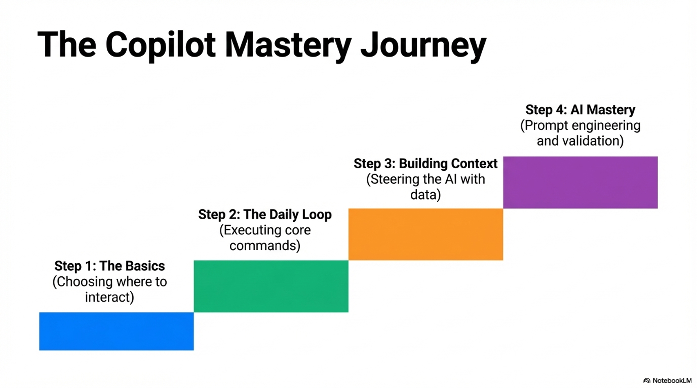

# 🚀 Mastering GitHub Copilot

A developer-focused session explaining how to effectively use GitHub Copilot to improve productivity, testing, and development workflows.

## 📚 Topics Covered

- Why AI tools are necessary for developers
- Prompt engineering for developers
- Copilot commands and workflow
- Workspace & terminal AI assistance
- PR review automation
- Best practices for unit testing with AI

## ⚡ Key Takeaway

> AI will not replace developers.  
> Developers who use AI will replace those who don't.

## Copilot Mastery Journey

## 📂 Presentation

Download the presentation:

Mastering_GitHub_Copilot.pptx

## 💡 Examples Included

- `/optimize`
- `/refactor`
- `/simplify`
- `@workspace`
- `@terminal`
- `@github`

## 🎯 Who is this for?

- Software engineers
- AI curious developers
- Teams adopting AI development tools

## 🌟 If this helped you

Star ⭐ this repository.
